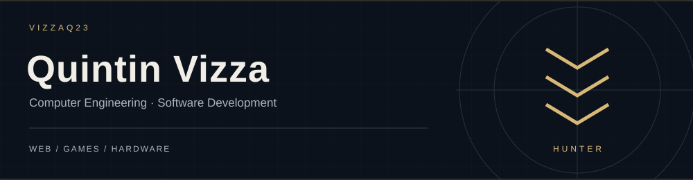
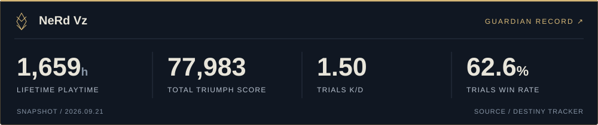
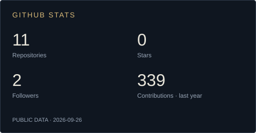
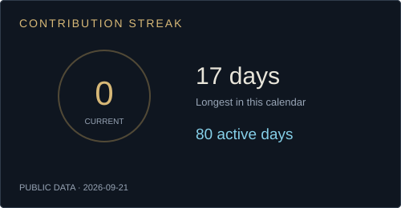
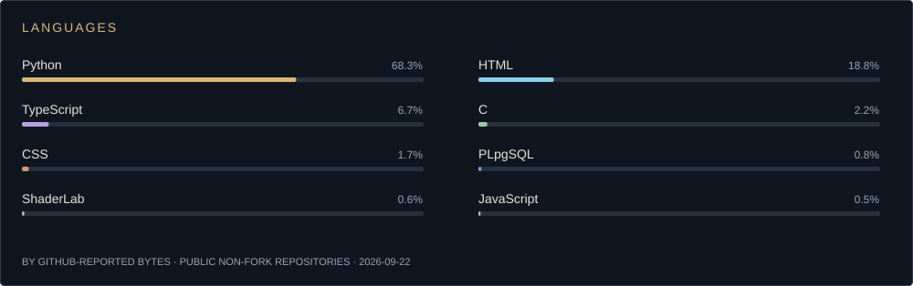
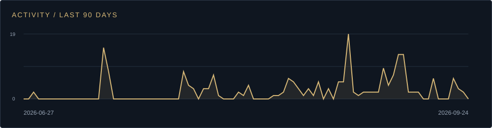
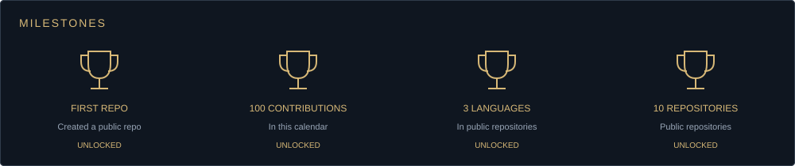
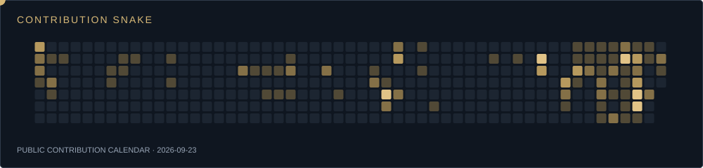
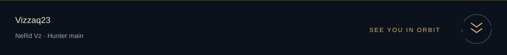

  
  

  
  
  

  <a href="#user-content-about">ABOUT</a> · <a href="#user-content-tech">TECH</a> · <a href="#user-content-currently">CURRENTLY</a> · <a href="#user-content-projects">PROJECTS</a> · <a href="#user-content-destiny-2">DESTINY 2</a> · <a href="#user-content-github-stats">STATS</a> · <a href="#user-content-links">LINKS</a>

## About

I'm Quintin. I studied Computer Engineering at Sacred Heart and interned at Sentari AI. I work with TypeScript and Python a lot, and I like projects that involve games or hardware.

A few things I've built: a One Piece card collection app, a Unity aim trainer, and the software for a Raspberry Pi pinball machine. Outside of that, I play Destiny 2. Hunter main, **NeRd Vz**.

<table>
<tr>
<td width="50%" valign="top">
<strong>Background</strong>  
B.S. Computer Engineering · May 2026 
Mathematics minor · Sacred Heart University 
Software Engineering Intern · Sentari AI, summer 2025
</td>
<td width="50%" valign="top">
<strong>Find me</strong>  
GitHub · <a href="https://github.com/Vizzaq23">Vizzaq23</a> 
Portfolio · <a href="https://quintinvizza.dev">quintinvizza.dev</a> 
Destiny · <a href="https://destinytracker.com/destiny-2/profile/xbl/4611686018434159333/overview">NeRd Vz</a>
</td>
</tr>
</table>

## Tech

Tools and languages from my projects and internship.

### Languages

### Frontend

### Backend and APIs

### Data

### Game development

### Hardware

### Deployment

### Tools and practice

## Currently

<table>
<tr>
<td width="33%" valign="top">
<strong>Practice</strong>  
<a href="https://github.com/Vizzaq23/neetcode-submissions">NeetCode submissions</a> 
Python · algorithms · problem solving
</td>
<td width="34%" valign="top">
<strong>Reference docs</strong>  
<a href="https://nextjs.org/docs">Next.js</a> · <a href="https://react.dev/learn">React</a> 
<a href="https://supabase.com/docs">Supabase</a> · <a href="https://docs.unity3d.com/Manual/">Unity</a>
</td>
<td width="33%" valign="top">
<strong>Certifications</strong>  
FE exam · passed April 2026 
<a href="https://www.credly.com/badges/bab7b21d-e63a-4634-a44a-cfa8990246b3">Verify on Credly ↗</a>
</td>
</tr>
</table>

## Projects

<strong>One Piece TCG Shelf</strong> · TypeScript / Next.js / PostgreSQL

A card collection app with public profiles, authentication, and cached market prices. The database uses row-level security to keep each user's collection separate.

[Live app](https://tcg-lyart.vercel.app/) · [Code](https://github.com/Vizzaq23/TCG) · [Case study](https://www.quintinvizza.dev/projects/tcg-shelf)

<strong>Pinball Scoreboard</strong> · Python / Pygame / Raspberry Pi

My team capstone. I led the scoring software and Raspberry Pi GPIO integration for a custom pinball machine. There is also a keyboard mode for testing without the hardware.

[Code](https://github.com/Vizzaq23/pinball-scoreboard)

<strong>Adaptive Combat Trainer</strong> · Unity / C#

An aim trainer with difficulty that changes based on player performance.

[Code](https://github.com/Vizzaq23/AdpativeShooter) · [Demo](https://www.quintinvizza.dev/demos/trainer-20260911.mp4)

<strong>Gameplay Coach</strong> · TypeScript

A project for analyzing gameplay and giving feedback.

[Code](https://github.com/Vizzaq23/cod-pov-coach)

<strong>Portfolio and other work</strong>

- [Portfolio](https://quintinvizza.dev) · [Source](https://github.com/Vizzaq23/my-portfolio)
- [AI Game Balancer](https://github.com/Vizzaq23/ai-game-balancer-)
- [NeetCode submissions](https://github.com/Vizzaq23/neetcode-submissions)
- [All repositories](https://github.com/Vizzaq23?tab=repositories)

## How I build

| 01 · Scope | 02 · Prototype | 03 · Build | 04 · Test | 05 · Share |
| :--- | :--- | :--- | :--- | :--- |
| Pick a specific problem. | Get the core idea working. | Add the pieces it needs. | Check edge cases and real inputs. | Write it up and put it online. |

## Destiny 2

**NeRd Vz · Hunter main**

More Destiny stats

| Stat | Value |
| :--- | ---: |
| Lifetime matches | 8,596 |
| Lifetime kills, all activities | 276,098 |
| Trials matches | 1,632 |
| Trials K/D | 1.50 |
| Trials win rate | 62.6% |

[Destiny Tracker](https://destinytracker.com/destiny-2/profile/xbl/4611686018434159333/overview) · *Snapshot from September 21, 2026.*

## GitHub stats

  
  

Public GitHub data · dates are printed on the cards · milestones are custom, not GitHub-issued awards.

## Links

  
  
  
  
  

